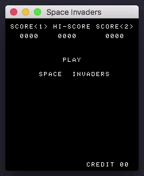

# Space Invaders

A Space Invaders emulator, written in C with OpenGL (and GLFW).



To run it: `make && ./invaders`. Keys are: `c` to insert a coin, `enter` to start a game (`2` for two-player mode), `left` / `right` to move, and `space` to shoot.

To run the tests, run with `--test`. The emulator passes the following tests:
- [x] TST8080.COM
- [x] 8080PRE.COM
- [ ] 8080EX1.COM
- [x] CPUTEST.COM

# Tests output

Output of invaders when `--test` is passed as argument:

```
***********************
MICROCOSM ASSOCIATES 8080/8085 CPU DIAGNOSTIC VERSION 1.0  (C) 1980

CPU IS OPERATIONAL
Jumped to 0x000 from 0x014F

***********************
8080 Preliminary tests complete
Jumped to 0x000 from 0x032F

***********************

DIAGNOSTICS II V1.2 - CPU TEST
COPYRIGHT (C) 1981 - SUPERSOFT ASSOCIATES

ABCDEFGHIJKLMNOPQRSTUVWXYZ
CPU IS 8080/8085
BEGIN TIMING TEST
END TIMING TEST
CPU TESTS OK

Jumped to 0x000 from 0x3B25
```

# To do

- fix CPU to pass remaining test
- add sound
- big-endian systems?

# Resources used

- [CPU instructions](http://nemesis.lonestar.org/computers/tandy/software/apps/m4/qd/opcodes.html) and [these](http://www.pastraiser.com/cpu/i8080/i8080_opcodes.html)
- [thibaultimbert's Intel8080](https://github.com/thibaultimbert/Intel8080/blob/master/8080.js) and [begoon's i8080-js](https://github.com/begoon/i8080-js)
